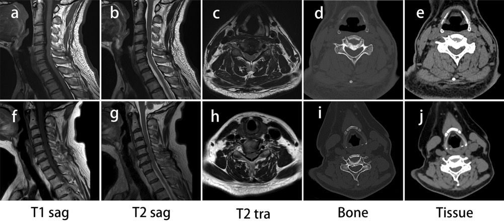
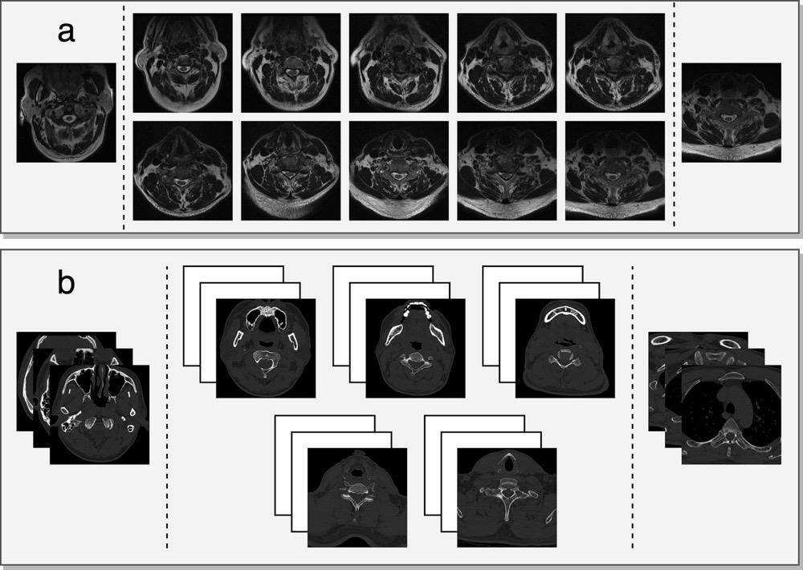
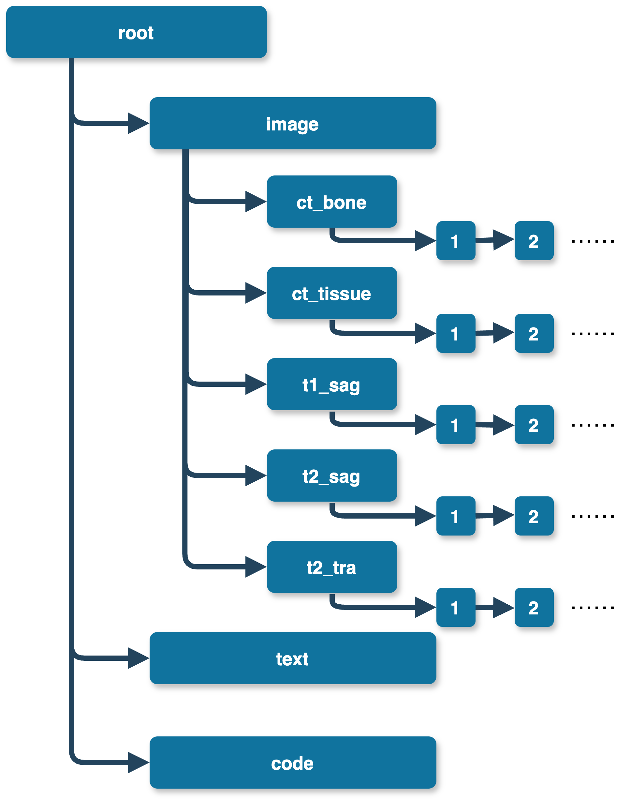
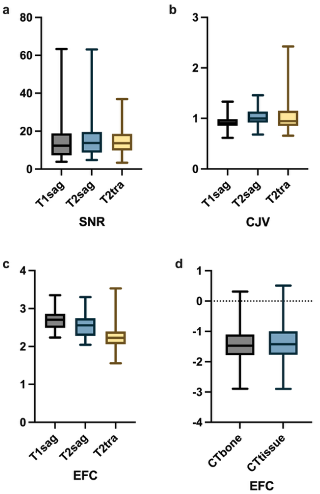
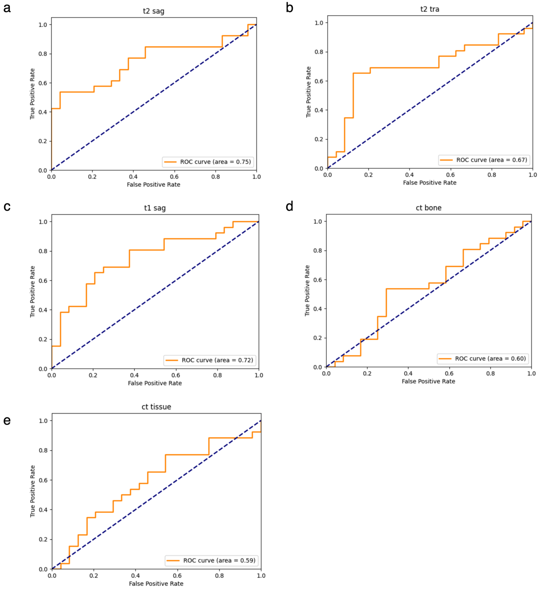

# MMCSD: Multi-modal and Multi-view Cervical Spondylosis Imaging Dataset

MRI images and CT images of patients with cervical spondylosis with severe neck pain




## What is MMCSD?

Neck pain is one of the most common symptoms of cervical spondylosis, and it is also the most common symptom that patients find themselves with cervical spondylosis. The MMCSD collection includes MRI and CT images from 250 patients with cervical spondylosis, a total of 3289 image slices. It consists of axial bone and soft tissue window CT scans, sagittal T1-and T2-weighted MRI, and axial T2-weighted MRI.

The MMCSD dataset was used to drive the deep learning model to find the cause of neck pain. MMCSD provided preoperative visual analogue scale (VAS) scores, VAS scores at one-year follow-up after surgery, and other clinical information, including demographic details, clinical diagnosis, and surgical information. Through the verification of this data and deep learning, it provides data support for the surgical method.

MMCSD manually deleted the blank slices other than the cervical spine, retained the slices with effective cervical spine structure information, and converted them from dicom format to NIfTI format to facilitate subsequent model training.



## Data

The file directory structure of this dataset is shown in the figure.The files are divided into three folders, image, text and code. The image folder holds images from different view and modal (ct bone; ct tissue; t1 sag; t2 sat; t2 tra). text stored the patient's clinical information, including the patient's age, gender, surgical method, etc., and included the vas score collected before surgery and the vas score of one-year follow-up after surgery.The code file contains the training and validation split files and the validation code




## Download

MMCSD data is hosted on the xxx platform, and you can download the corresponding data set images and training weights through the link.

| Name       | Image | Weights |
| ---------- | ----- | ------- |
| MRI T2 sag |       |         |
| MRI T2 tra |       |         |
| MRI T1 sag |       |         |
| CT bone    |       |         |
| CT tissue  |       |         |

## Test

python3.6+ and [conda](https://anaconda.org/) need to be installed on your server.The results in the paper can be easily reproduced by executing the following code.

```shell
conda create -n MMCSD python=3.6
conda activate MMCSD
```

Install the required dependencies

```shell
pip install -r requirements.txt
```

Run roc.py, the code will input all the metrics and generate the corresponding roc curve

```shell
python roc.py --name t2sag --img_path ./image/t2_sag --pth_path ./t2_sag.pth --label_path ./high_pain_text.xlsx
```

## result

| **Sequence** | **Accuracy** | **Precision** | **NPV** | **Sensitivity** | **Spesificity** | **F1  Score** | **AUC** |
| ------------ | ------------ | ------------- | ------- | --------------- | --------------- | ------------- | ------- |
| T2 sag       | 0.74         | 0.933         | 0.657   | 0.538           | 0.958           | 0.683         | 0.748   |
| T1 sag       | 0.72         | 0.772         | 0.679   | 0.654           | 0.792           | 0.708         | 0.723   |
| T2 tra       | 0.66         | 0.8           | 0.6     | 0.462           | 0.875           | 0.585         | 0.668   |
| CT bone      | 0.60         | 0.636         | 0.571   | 0.539           | 0.667           | 0.583         | 0.603   |
| CT tissue    | 0.58         | 0.692         | 0.541   | 0.346           | 0.833           | 0.461         | 0.589   |

## 







## Citing MMCSD
